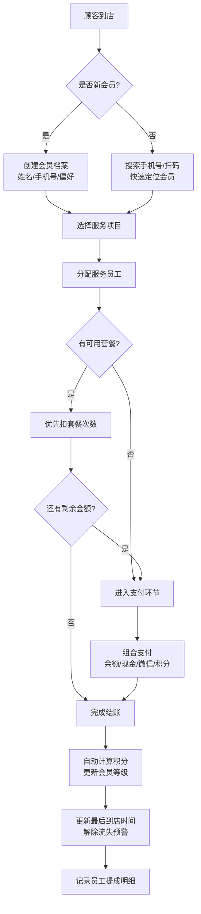

## 1. 产品概述

美发/美容门店会员管理系统，专为小型美容美发门店设计，一站式管理顾客档案、消费记录、会员卡套餐、员工提成与经营数据。解决小店手工记账混乱、会员流失率高、提成计算繁琐等痛点。

- 目标用户：美发店/美容店店主及店员，1-10人规模的小型门店
- 核心价值：轻量化、易上手、功能全，提升门店运营效率和会员复购率

## 2. 核心功能

### 2.1 用户角色

| 角色 | 登录方式 | 核心权限 |
|------|----------|----------|
| 店主/管理员 | 账号密码登录 | 全部功能：会员管理、消费录入、数据统计、员工管理、系统设置 |
| 店员 | 账号密码登录 | 会员查询、消费录入、充值扣次、套餐核销（不可修改员工权限和查看全部报表） |

### 2.2 功能模块

1. **数据仪表盘**：今日收入、本月新增/流失会员、项目销售占比图表、员工提成排行
2. **会员管理**：会员档案CRUD、手机号搜索、偏好记录（惯用发型师、过敏成分）、流失预警标记
3. **消费收银**：服务项目录入、金额计算、积分自动累计、余额核销、会员卡支付、套餐卡扣次
4. **会员卡管理**：储值卡充值、套餐卡购买（买10送2等）、消费记录流水
5. **营销中心**：流失会员列表（>60天未到店）、一键短信唤回、生日祝福推送、优惠券发放
6. **员工管理**：员工账号CRUD、服务项目提成比例设置、员工提成统计报表

### 2.3 页面详情

| 页面名称 | 模块名称 | 功能描述 |
|----------|----------|----------|
| 登录页 | 登录表单 | 账号密码登录、角色权限区分、记住密码 |
| 数据仪表盘 | 顶部指标卡 | 今日收入、今日客流量、本月新增会员、本月流失会员 |
| 数据仪表盘 | 收入趋势图 | 近7天/30天收入折线图 |
| 数据仪表盘 | 项目销售饼图 | 各服务项目销售金额占比环形图 |
| 数据仪表盘 | 员工提成排行 | 本月员工提成金额排名条形图 |
| 会员列表页 | 搜索栏 | 手机号/姓名搜索、流失预警筛选、会员等级筛选 |
| 会员列表页 | 会员卡片 | 头像、姓名、等级、余额、积分、剩余套餐、到店频率标记 |
| 会员新增/编辑页 | 基本信息 | 姓名、手机号、性别、生日、头像上传 |
| 会员新增/编辑页 | 偏好设置 | 惯用发型师下拉、过敏史标签、备注 |
| 会员详情页 | 会员概览 | 余额、积分、等级、消费次数、最近到店、流失状态 |
| 会员详情页 | 消费记录 | 时间倒序的服务项目消费列表（项目、金额、员工、扣次/扣款） |
| 会员详情页 | 套餐管理 | 已购套餐卡片（剩余次数/总次数、有效期） |
| 消费收银页 | 会员查找 | 扫码框、手机号搜索快速定位会员 |
| 消费收银页 | 项目选择 | 服务项目多选列表（价格、预计时长） |
| 消费收银页 | 服务员工 | 每个项目选择对应服务员工（用于提成计算） |
| 消费收银页 | 支付方式 | 余额支付/现金/微信/支付宝组合支付、积分抵扣 |
| 消费收银页 | 扣次确认 | 套餐卡自动匹配扣次，确认弹窗显示剩余次数 |
| 充值中心页 | 储值充值 | 充值金额选择（含赠送金额档位）、自定义金额 |
| 充值中心页 | 套餐购买 | 套餐卡列表（买10送2标注、原价/优惠价、有效期） |
| 营销中心页 | 流失预警列表 | >60天未到店会员列表（上次到店日期、历史消费总额）、一键发送优惠短信 |
| 营销中心页 | 生日提醒 | 今日/本周生日会员列表、一键发送祝福+专属优惠券 |
| 员工管理页 | 员工列表 | 姓名、角色、手机号、入职日期、状态开关 |
| 员工管理页 | 提成设置 | 各服务项目对应员工提成比例（按比例或固定金额） |
| 员工提成报表页 | 明细报表 | 按员工/时间维度统计服务次数、提成金额明细 |

## 3. 核心流程

### 3.1 新顾客建档消费流程
顾客首次到店 → 店员录入基本信息（姓名、手机号、生日、偏好）→ 创建会员档案 → 选择服务项目和服务员工 → 选择支付方式（现金/微信/支付宝）→ 确认结账 → 系统自动计算积分并更新会员等级

### 3.2 老会员消费流程
店员输入手机号/扫码 → 定位会员 → 显示余额/积分/套餐 → 选择服务项目 → 自动匹配可用套餐扣次（优先扣次）→ 剩余金额用余额/其他方式支付 → 积分累加 → 消费完成，自动更新最近到店时间

### 3.3 流失预警与唤回流程
系统每日检查会员最后到店时间 → 超过60天自动标记为"流失预警" → 营销中心流失列表展示 → 店员选择会员 → 一键发送唤回短信（含专属优惠券）→ 顾客到店消费后自动解除预警标记

### 3.4 员工提成计算流程
每笔消费记录关联服务员工和项目 → 按项目提成规则（比例/固定）计算提成 → 员工提成报表按日/月汇总 → 管理员可导出明细

## 4. 界面设计

### 4.1 设计风格

**设计方向：精致温暖的沙龙质感**

- 主色调：香槟金渐变（#D4A853 → #B8923E），传递高端美发沙龙的品质感
- 辅助色：玫瑰粉（#E8B4B8）用于会员等级、营销标签；深墨绿（#2D4A3E）用于数据图表；象牙米白（#FBF8F3）为背景
- 中性色：炭灰（#1F2328）主文字、暖灰（#6B6560）次文字、米灰（#EDE8E1）分割线
- 按钮风格：圆角8px，渐变填充+细腻投影，hover有光泽滑动效果
- 字体：中文使用思源宋体（展示性标题）+ Noto Sans SC（正文），营造沙龙杂志感
- 布局风格：顶部导航+左侧子菜单，卡片式模块，柔和的大圆角（12px-16px）和浅投影
- 图标风格：线性+部分填充混合图标，搭配香槟金描边
- 氛围细节：细腻的噪点纹理背景、卡片悬浮微动画、数据图表入场动画

### 4.2 页面设计概览

| 页面名称 | 模块名称 | UI元素 |
|----------|----------|----------|
| 登录页 | 登录表单区 | 左侧品牌插画（剪刀/梳子金色线稿）、右侧香槟金渐变卡片、输入框带图标、登录按钮大圆角投影 |
| 数据仪表盘 | 顶部指标卡 | 4张渐变指标卡（收入-金色/客流-墨绿/新增-粉色/流失-红色边框）、大数字+小型趋势箭头 |
| 数据仪表盘 | 图表区域 | 双栏布局：左侧收入趋势折线图（香槟金线条+渐变填充）、右侧项目占比环形图（多彩色段+中心总数）、下方员工提成横向条形图 |
| 会员列表页 | 顶部操作区 | 搜索框（带放大镜+扫码图标）、筛选标签（全部/预警/黄金会员等）、新增会员按钮 |
| 会员列表页 | 会员卡片 | 头像（首字渐变圆）、姓名+等级徽章（金/银/铜边框）、余额积分标签、最近到店时间、流失预警红色丝带标记 |
| 会员详情页 | 会员头部 | 大图头像+基本信息横排、快速操作按钮（消费/充值/发短信）、流失状态大标签 |
| 消费收银页 | 左栏会员区 | 大搜索框、选中会员信息卡（余额/积分/套餐醒目展示）、快速消费数字键盘 |
| 消费收银页 | 右栏收银区 | 项目网格选择（图片+名称+价格）、已选项目清单（可增减数量+选员工）、底部支付面板（支付方式选择+金额合计+确认支付大按钮） |
| 充值中心页 | 储值档位 | 3列阶梯式卡片（300/500/1000元，赠送金额金色标签）、选中态金色边框高亮 |
| 营销中心页 | 流失会员卡片 | 红色预警图标、上次到店天数（大字）、历史消费总额、一键唤回按钮（含短信图标） |
| 员工管理页 | 员工卡片 | 头像、姓名+角色徽章、手机号、提成比例快捷编辑入口、在职/离职开关 |

### 4.3 响应式

- 桌面优先：主要适配1440px宽度，最小宽度1280px
- 平板端（≤1024px）：左侧菜单收起为图标模式，卡片列表从3列变2列
- 移动端（≤768px）：顶部导航折叠为汉堡菜单，卡片单列布局，消费收银页改为上下结构
- 触控优化：按钮最小高度44px，表单输入框加大内边距，表格支持横向滚动

### 4.4 动效设计

- 页面入场：卡片从下往上依次浮现（stagger 80ms），配合透明度渐入
- 数据变化：数字从旧值平滑滚动到新值（countUp效果）
- 支付成功：金色对勾圆圈动画+轻量震动反馈
- 会员搜索：输入时0.3s节流防抖，结果列表淡入
- 标签徽章：会员等级边框有微弱呼吸光效
