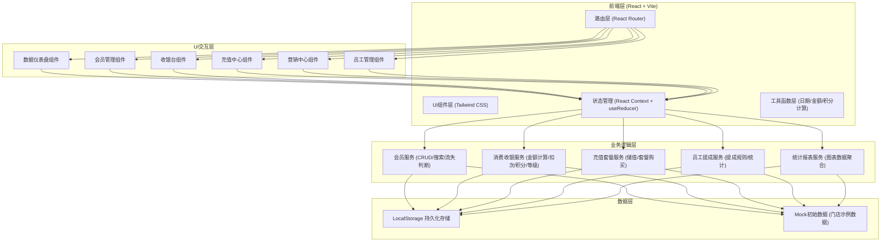
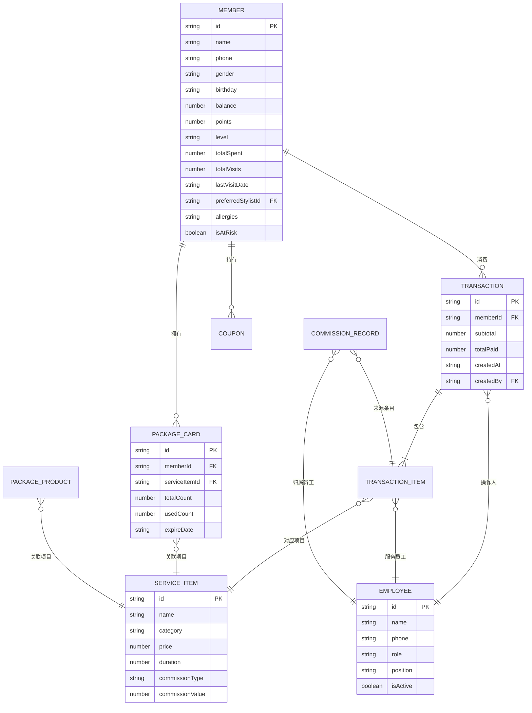

## 1. 架构设计



## 2. 技术说明

- **前端框架**: React@18 + React Router DOM@6
- **构建工具**: Vite@5 (极速HMR)
- **样式方案**: Tailwind CSS@3 (原子化CSS，配合自定义主题)
- **UI组件库**: 自定义组件 + Lucide React图标库
- **图表库**: Recharts (React生态轻量图表，支持折线/饼图/条形图)
- **状态管理**: React Context + useReducer (轻量级，无需Redux)
- **数据持久化**: LocalStorage (门店单机使用场景，无需后端)
- **数据初始化**: 内置Mock数据（30+会员、10+服务项目、5名员工、6个月消费记录）
- **日期处理**: dayjs (轻量日期库)

## 3. 路由定义

| 路由路径 | 页面用途 | 访问权限 |
|----------|----------|----------|
| /login | 登录页（账号密码+角色选择） | 公开 |
| /dashboard | 数据仪表盘：收入/客流/项目占比/提成排行 | 全部角色 |
| /members | 会员列表：搜索/筛选/流失预警标记 | 全部角色 |
| /members/new | 新增会员档案 | 全部角色 |
| /members/:id | 会员详情：消费记录/套餐/偏好 | 全部角色 |
| /members/:id/edit | 编辑会员档案 | 全部角色 |
| /cashier | 消费收银台：找会员→选项目→支付结账 | 全部角色 |
| /recharge | 充值中心：储值充值/套餐购买 | 全部角色 |
| /marketing | 营销中心：流失预警/生日祝福/优惠券 | 全部角色 |
| /employees | 员工管理：员工账号/角色/状态 | 仅管理员 |
| /employees/commission | 员工提成统计报表 | 仅管理员 |
| /settings | 系统设置：服务项目/提成规则/积分规则 | 仅管理员 |

## 4. 核心类型定义 (TypeScript)

```typescript
// 会员等级
type MemberLevel = '普通' | '银卡' | '金卡' | '钻石';

// 会员档案
interface Member {
  id: string;
  name: string;
  phone: string;
  gender: '男' | '女';
  birthday: string; // YYYY-MM-DD
  avatar?: string;
  balance: number; // 储值余额
  points: number; // 积分
  level: MemberLevel;
  totalSpent: number; // 累计消费
  totalVisits: number; // 到店次数
  lastVisitDate: string; // 上次到店
  preferredStylistId?: string; // 惯用发型师
  allergies: string[]; // 过敏成分标签
  remark: string;
  createdAt: string;
  isAtRisk: boolean; // 流失预警标记
}

// 服务项目
interface ServiceItem {
  id: string;
  name: string;
  category: '美发' | '美容' | '美甲' | '其他';
  price: number;
  duration: number; // 分钟
  commissionType: 'ratio' | 'fixed';
  commissionValue: number; // 比例(%)或固定金额
  isActive: boolean;
}

// 套餐卡
interface PackageCard {
  id: string;
  memberId: string;
  serviceItemId: string;
  serviceItemName: string;
  totalCount: number;
  usedCount: number;
  purchaseDate: string;
  expireDate: string;
  purchasePrice: number;
}

// 消费记录
interface Transaction {
  id: string;
  memberId: string;
  memberName: string;
  items: TransactionItem[];
  subtotal: number; // 项目合计
  packageDeducted: number; // 套餐抵扣金额
  pointsUsed: number; // 积分抵扣
  pointsEarned: number; // 本次获得积分
  balanceUsed: number; // 余额支付
  cashPaid: number;
  wechatPaid: number;
  alipayPaid: number;
  totalPaid: number; // 实付金额
  createdAt: string;
  createdBy: string; // 操作员工ID
}

interface TransactionItem {
  serviceItemId: string;
  serviceItemName: string;
  price: number;
  quantity: number;
  employeeId: string;
  employeeName: string;
  usePackage: boolean; // 是否扣套餐次数
  packageId?: string;
  commissionAmount: number; // 该条目的员工提成
}

// 员工
interface Employee {
  id: string;
  name: string;
  phone: string;
  role: 'admin' | 'staff';
  password: string; // 演示用明文
  position: string; // 职位：首席发型师/技师/美容师等
  hireDate: string;
  isActive: boolean;
  avatar?: string;
}

// 充值档位
interface DepositTier {
  amount: number;
  bonusAmount: number;
}

// 套餐产品
interface PackageProduct {
  id: string;
  name: string;
  serviceItemId: string;
  serviceItemName: string;
  totalCount: number;
  bonusCount: number;
  price: number;
  validDays: number;
}

// 优惠券
interface Coupon {
  id: string;
  memberId: string;
  name: string;
  discountType: 'fixed' | 'percent';
  discountValue: number;
  minAmount: number;
  expireDate: string;
  isUsed: boolean;
  createdAt: string;
}
```

## 5. 数据模型ER图



## 6. 关键业务规则

### 6.1 会员等级规则
| 等级 | 累计消费门槛 | 权益 |
|------|------------|------|
| 普通会员 | 0元 | 1元=1积分 |
| 银卡会员 | 500元 | 1元=1.2积分，9.5折 |
| 金卡会员 | 2000元 | 1元=1.5积分，9折 |
| 钻石会员 | 5000元 | 1元=2积分，8.5折 |

### 6.2 积分规则
- 积分获得：消费金额 × 等级倍率（余额支付才累计积分）
- 积分抵扣：100积分 = 1元（单次消费最多抵扣实付金额的20%）
- 积分有效期：每年12月31日清空上一年未使用积分

### 6.3 流失预警规则
- 距 lastVisitDate 超过 60 天 → 自动标记 isAtRisk = true
- 消费结账后 → 自动更新 lastVisitDate → 解除预警

### 6.4 套餐扣次优先级
- 消费时，若会员有对应项目的套餐卡且剩余次数>0 → 优先扣套餐次数
- 多个同项目套餐 → 按到期时间升序扣次（先过期的先用）

### 6.5 提成计算
- ratio（按比例）：提成 = 该条项目实收金额 × commissionValue%
- fixed（固定）：提成 = commissionValue × 数量
- 提成归属：TRANSACTION_ITEM 中指定的 employeeId
